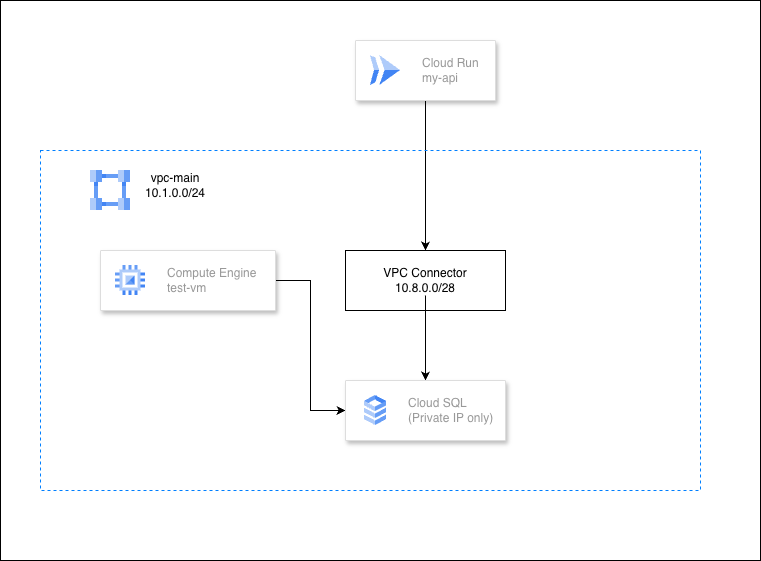

# GCP Serverless VPC Access

Let Cloud Run reach private VPC resources — databases, VMs, internal APIs — without exposing them to the internet.

Cloud Run runs on Google's serverless infrastructure, which is outside your VPC. If you have a Cloud SQL database or internal service on a private IP, Cloud Run can't reach it by default. Serverless VPC Access Connector creates a bridge between Cloud Run and your VPC.

> **Duration**: 45 minutes  
> **Level**: Intermediate

**What you'll build:**
- Cloud Run API that connects to Cloud SQL over private IP
- VPC Access Connector bridging Cloud Run into your VPC
- Cloud SQL with zero public exposure
- A test VM for manual verification

## Architecture




The VPC Connector is a managed resource that runs small VMs (e2-micro) in your VPC subnet. When Cloud Run sends traffic to private IP ranges, it routes through the connector into your VPC.

## Prerequisites

- GCP account with billing enabled
- `gcloud` CLI installed and authenticated
- Terraform >= 1.0

## Deploy

### Step 0: Clone the Repo

```bash
git clone https://github.com/misskecupbung/gcp-serverless-vpc-access.git
cd gcp-serverless-vpc-access
```

### Step 1: Enable APIs

```bash
export PROJECT_ID="your-project-id"
gcloud config set project $PROJECT_ID

gcloud services enable compute.googleapis.com
gcloud services enable vpcaccess.googleapis.com
gcloud services enable run.googleapis.com
gcloud services enable cloudbuild.googleapis.com
gcloud services enable iap.googleapis.com
gcloud services enable sqladmin.googleapis.com
gcloud services enable servicenetworking.googleapis.com
gcloud services enable cloudresourcemanager.googleapis.com
```

### Step 2: Build the Container Image

Terraform doesn't build Docker images, so this is the one manual step:

```bash
cd app
gcloud builds submit --tag gcr.io/$PROJECT_ID/my-api
cd ..
```

### Step 3: Deploy with Terraform

```bash
cd terraform

cp terraform.tfvars.example terraform.tfvars
sed -i "s/your-project-id/$PROJECT_ID/" terraform.tfvars

terraform init
terraform plan
terraform apply
```

Terraform creates:
- VPC with subnet
- Cloud Router and Cloud NAT (for VM internet access)
- Private Service Access (VPC peering to Google's managed network)
- Cloud SQL PostgreSQL 14 (private IP only, no public access)
- Serverless VPC Access Connector
- Test VM (no public IP)
- Firewall rules
- Cloud Run service wired to the VPC connector

> **Note**: Cloud SQL takes 5-10 minutes to create.

### Step 4: Check Outputs

```bash
terraform output
```

You'll see:
- `cloud_run_url` — Your API endpoint
- `cloud_sql_private_ip` — Cloud SQL private IP
- `test_vm_ip` — Internal IP of test-vm
- `vpc_connector_id` — Connector resource ID

## Verify

### 1. Check VPC Connector Status

```bash
gcloud compute networks vpc-access connectors describe my-connector \
    --region=us-central1 --format="value(state)"
```

Expected: `READY`

### 2. Test Cloud Run → Cloud SQL

```bash
cd terraform

SERVICE_URL=$(terraform output -raw cloud_run_url)

# Health check
curl -s $SERVICE_URL | jq .

# Test database connection
curl -s $SERVICE_URL/db | jq .
```

Expected: The `/db` endpoint returns the PostgreSQL version, confirming Cloud Run reached Cloud SQL through the VPC connector.

### 3. Test from VM → Cloud SQL

SSH into test-vm and connect directly:

```bash
DB_IP=$(terraform output -raw cloud_sql_private_ip)

# Check if PostgreSQL port is open
gcloud compute ssh test-vm --zone=us-central1-a --tunnel-through-iap \
    --command="pg_isready -h $DB_IP -U appuser"

# Run a query
gcloud compute ssh test-vm --zone=us-central1-a --tunnel-through-iap \
    --command="PGPASSWORD=changeme123 psql -h $DB_IP -U appuser -d appdb -c 'SELECT version();'"
```

### 4. Test Cloud Run → VM

```bash
TEST_VM_IP=$(terraform output -raw test_vm_ip)

curl -s "$SERVICE_URL/check-internal/$TEST_VM_IP" | jq .
```

Expected: Cloud Run reaches test-vm's nginx through the VPC connector.

## How the Connector Works

1. Terraform creates a `/28` subnet range (10.8.0.0/28) dedicated to the connector
2. GCP provisions 2-3 small VMs in that range (managed by Google)
3. Cloud Run is configured with `egress = PRIVATE_RANGES_ONLY`
4. When Cloud Run sends traffic to any RFC 1918 address (10.x, 172.16.x, 192.168.x), it routes through the connector
5. The connector VMs forward that traffic into your VPC

Public traffic (external APIs, etc.) still goes directly from Cloud Run — only private ranges use the connector.

## Cleanup

```bash
cd terraform
terraform destroy

# Delete container image
gcloud container images delete gcr.io/$PROJECT_ID/my-api --force-delete-tags --quiet
```

**If `terraform destroy` fails with "Producer services are still using this connection":**

Delete the VPC peering connection first:

```bash
gcloud services vpc-peerings delete \
  --network=vpc-main \
  --service=servicenetworking.googleapis.com
```

Then retry `terraform destroy`.

## Resources

- [Serverless VPC Access](https://cloud.google.com/vpc/docs/serverless-vpc-access)
- [Configure VPC Connector](https://cloud.google.com/vpc/docs/configure-serverless-vpc-access)
- [Cloud SQL Private IP](https://cloud.google.com/sql/docs/postgres/private-ip)

## License

MIT
